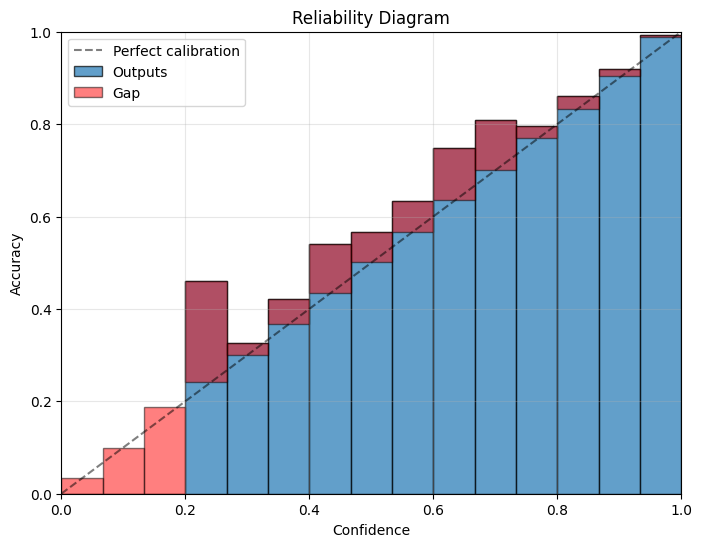

# Calibrating Vision Transformers using Ensemble Temperature Scaling

This project implements post-hoc calibration methods for Vision Transformers (ViTs) to improve the alignment between predicted confidence scores and true likelihoods using Ensemble Temperature Scaling (ETS).

ETS leverages the observation that different prediction strategies are optimal under different conditions:

- **Low confidence regions**: Uniform predictions reduce overconfidence
- **High confidence regions**: Temperature scaling maintains discriminative power
- **Intermediate regions**: Weighted combination provides smooth transitions

## Project Overview

Modern neural networks, including Vision Transformers, often exhibit overconfidence in their predictions. This project addresses this calibration problem by implementing and comparing three approaches:

1. **No Calibration**: Baseline uncalibrated model
2. **Temperature Scaling (TS)**: Standard post-hoc calibration method
3. **Ensemble Temperature Scaling (ETS)**: Advanced ensemble-based calibration

## Key Results

| Method                           | Accuracy (%) | Confidence (%) | ECE (%)  |
| -------------------------------- | ------------ | -------------- | -------- |
| No Calibration                   | 92.37        | 89.72          | 2.65     |
| Temperature Scaling              | 92.37        | 89.87          | 2.50     |
| **Ensemble Temperature Scaling** | **92.37**    | **90.67**      | **1.71** |

**Key Findings:**

- ETS achieves **35% reduction** in Expected Calibration Error (ECE) compared to uncalibrated model
- Maintains original accuracy while significantly improving calibration
- Better confidence-accuracy alignment as shown in reliability diagrams


_Figure 1: No Calibration_


_Figure 2: Temperature Scaling_



_Figure 3: Ensemble Temperature Scaling_

## Architecture & Implementation

### Vision Transformer Model

- **Base Model**: `google/vit-base-patch16-224`
- **Dataset**: CIFAR-10 (10 classes)
- **Training Strategy**: Fine-tuning only the classification head while freezing the backbone
- **Preprocessing**: Resize to 224×224, ImageNet normalization

### Calibration Methods

#### 1. Temperature Scaling

```python
class TemperatureScaling(nn.Module):
    def __init__(self):
        super().__init__()
        self.temperature = nn.Parameter(torch.ones(1) * 1.5)

    def forward(self, logits):
        return logits / self.temperature.clamp(min=1e-6)
```

#### 2. Ensemble Temperature Scaling

ETS combines three prediction components:

- **Component 1**: Temperature-scaled predictions `T(z; t)`
- **Component 2**: Uncalibrated predictions (t=1)
- **Component 3**: Uniform predictions (t=∞)

```python
def forward(self, logits):
    component1 = logits / self.temperature.clamp(min=1e-6)  # TS calibration
    component2 = logits.clone()                             # Uncalibrated
    component3 = torch.ones_like(logits) / num_classes      # Uniform

    return (self.weights[0] * component1 +
            self.weights[1] * component2 +
            self.weights[2] * component3)
```

## Implementation Details

### Model Training

- **Optimizer**: AdamW with learning rate 1e-4
- **Scheduler**: Cosine Annealing (5 epochs)
- **Loss Function**: Cross-Entropy Loss
- **Weight Decay**: 0.01
- **Batch Size**: 64

### Calibration Training

- **Optimizer**: L-BFGS for both TS and ETS
- **Learning Rate**: 0.01
- **Max Iterations**: 100
- **Loss Function**: Cross-Entropy Loss on validation set

### Evaluation Metrics

- **Accuracy**: Classification accuracy on test set
- **Confidence**: Average maximum predicted probability
- **ECE**: Expected Calibration Error with 15 bins
- **Reliability Diagrams**: Visual calibration assessment

## Usage

### 1. Training the Vision Transformer

```python
from model import ViTModel
from data_utils import CIFARDataLoader
from train import train_model

# Initialize model and data
model = ViTModel("google/vit-base-patch16-224", num_classes=10)
data_loader = CIFARDataLoader(batch_size=64)
train_loader, val_loader, test_loader = data_loader.get_data_loaders()

# Train model
train_model(model, train_loader, val_loader, criterion, optimizer, scheduler, num_epochs, device)
```

### 2. Applying Calibration

```python
from calibration import TemperatureScaling, EnsembleTemperatureScaling
from test_eval import get_logits_and_labels, get_all_metrics

# Get model predictions
logits, labels = get_logits_and_labels(model, test_loader, device)

# Temperature Scaling
ts_scaler = TemperatureScaling()
ts_scaler.calibrate(logits, labels)
ts_logits = ts_scaler(logits)

# Ensemble Temperature Scaling
ets_scaler = EnsembleTemperatureScaling()
ets_scaler.calibrate(logits, labels)
ets_logits = ets_scaler(logits)

# Evaluate
ts_metrics = get_all_metrics(ts_logits, labels)
ets_metrics = get_all_metrics(ets_logits, labels)
```

### 3. Generating Reliability Diagrams

```python
from test_eval import reliability_diagram

reliability_diagram(logits, labels, title="Uncalibrated")
reliability_diagram(ts_logits, labels, title="Temperature Scaling")
reliability_diagram(ets_logits, labels, title="Ensemble Temperature Scaling")
```

## References

1. **Guo, C., Pleiss, G., Sun, Y., & Weinberger, K. Q.** (2017). "On Calibration of Modern Neural Networks." _International Conference on Machine Learning (ICML)_.

2. **Zhang, J., Kailkhura, B., & Han, T. Y. J.** (2020). "Mix-n-Match: Ensemble and Compositional Methods for Uncertainty Calibration in Deep Learning." _arXiv preprint arXiv:2003.07329_.
